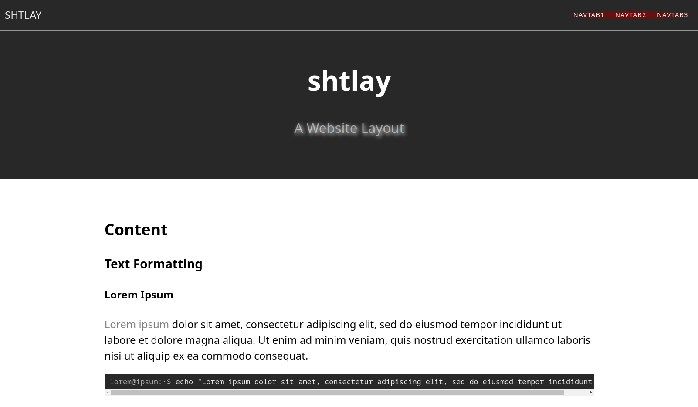
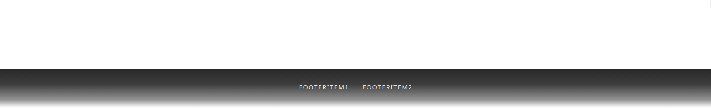
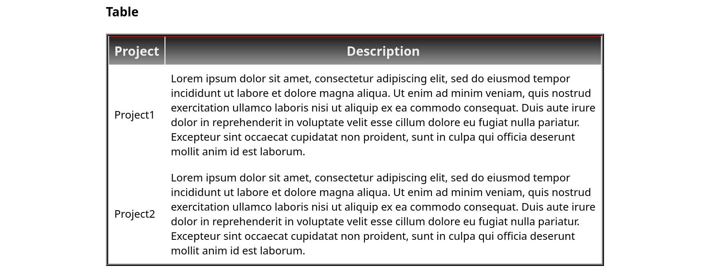
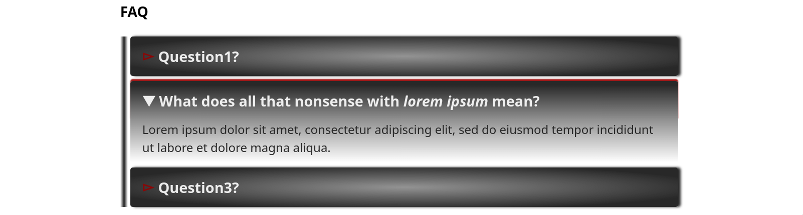
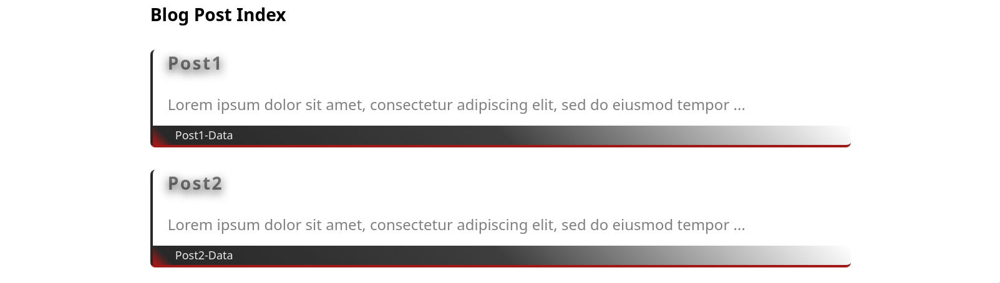
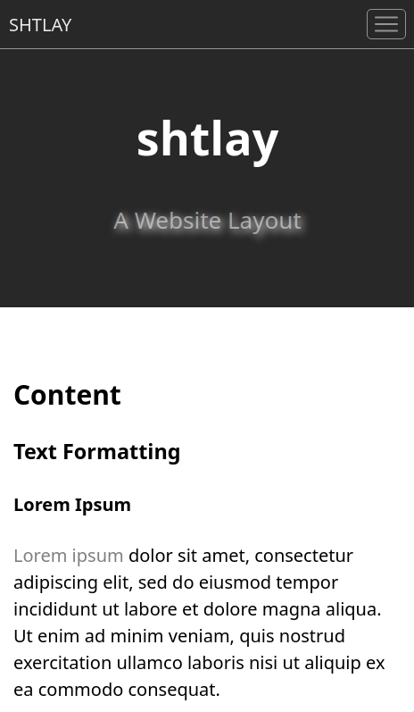
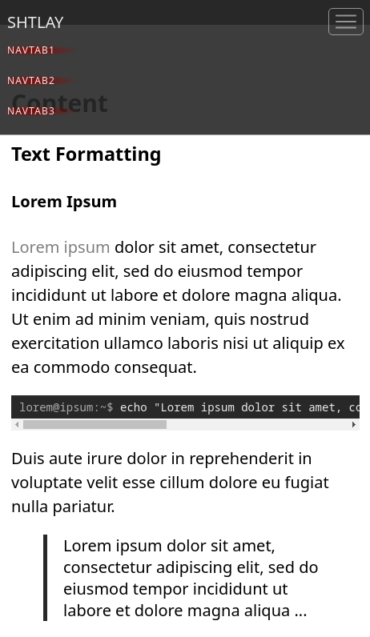

# shtlay

[![UNLICENSE licensed][license-badge]][license-url]

[license-badge]: https://img.shields.io/badge/license-UNLICENSE-blue.svg
[license-url]: ./UNLICENSE

A website layout for [jekyll](https://github.com/jekyll/jekyll) made up by

- a [Liquid template](public/shtlay.liquid)
- a [CSS](public/shtlay.css)
- a [TypeScript](src/index.ts)

leveraging

- ideas from [bootstrap](https://github.com/twbs/bootstrap) for responsive web design.
- [jekyll-pygments-themes](https://github.com/jwarby/jekyll-pygments-themes) for syntax highlighting.

### Installation

To install shtlay, first clone the repo.
Then generate the (servable) `dist` directory by running the following commands in the context of the repo top-level:

```console
user@host:~$ git submodule update --init --recursive
user@host:~$ npm install
user@host:~$ npm build
```

### Usage

To view shtlay in the browser, you can serve the `dist` directory locally on `http://127.0.0.1:8080` with

```console
user@host:~$ npm serve
```

To incorporate shtlay into your jekyll website you can copy the following files to the appropriate places:

- [dist/shtlay.css](dist/shtlay.css)
- [dist/shtlay.js](dist/shtlay.js)
- [dist/shtlay.liquid](dist/shtlay.liquid)
- [dist/syntax.css](dist/syntax.css)

### Screenshots

#### Desktop

> 

###### Page Scrolled

> 

###### Footer

> 

###### Table

> 

###### FAQ

> 

###### Blog Post Index

> 

#### Mobile

<p float="left" >
  
  
  
</p>
