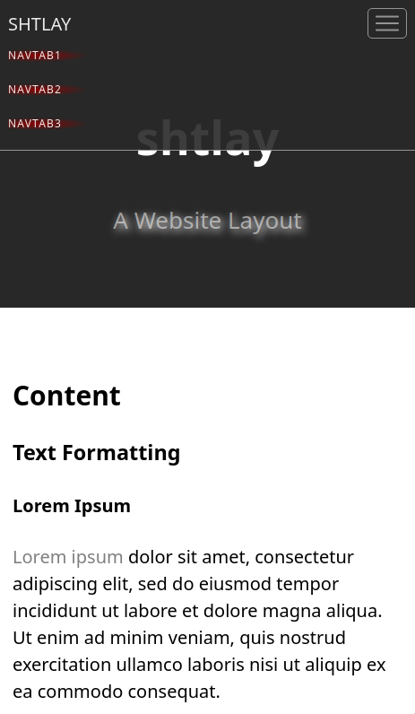

# shtlay

[![UNLICENSE licensed][license-badge]][license-url]

[license-badge]: https://img.shields.io/badge/license-UNLICENSE-blue.svg
[license-url]: ./UNLICENSE

A **responsive** webpage layout made up by

- a [Liquid template](public/shtlay.liquid)
- a [CSS](public/shtlay.css)
- a tiny bit of [TypeScript](src/index.ts)

for **informative** websites which are statically generated with [jekyll](https://github.com/jekyll/jekyll) and have a need for its syntax highlighting feature based on [jekyll-pygments-themes](https://github.com/jwarby/jekyll-pygments-themes).

- responsiveness
  * lightweight and modern CSS
  * media queries for most common devices
  * [bootstrap](https://github.com/twbs/bootstrap)-like navigation
- informative components styling
  * table styling
  * details/summary styling
  * FAQ styling (based on details/summary styling)
  * blog post index styling

To get a first impression of shtlay see the ['Screenshots' section](#screenshots).

### Installation

To install shtlay, first clone the repo.
Then generate the (servable) `dist` directory by running the following commands in the context of the repo top-level:

```console
user@host:~$ git submodule update --init --recursive
user@host:~$ npm install
user@host:~$ npm run build
```

Finally, copy the following files to the appropriate places:

- `dist/shtlay.css`
- `dist/shtlay.js`
- `dist/shtlay.js.map`
- `dist/shtlay.liquid`
- `dist/syntax.css`

### Usage

To learn how to use shtlay, you have to work through `dist/shtlay.liquid` and `dist/index.html`.

However, for a quick view in the browser, you can serve the `dist` directory locally on `http://127.0.0.1:8080` with

```console
user@host:~$ npm run serve
```

### Screenshots

#### Desktop

> 

###### Page Scrolled

> 

###### Footer

> 

###### Table

> 

###### FAQ

> 

###### Blog Post Index

> 

#### Mobile

<p float="left" >
  
  
  
</p>
